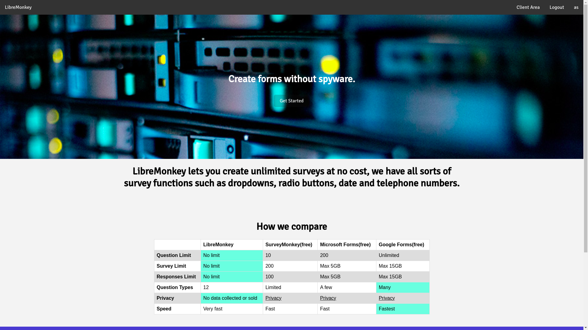
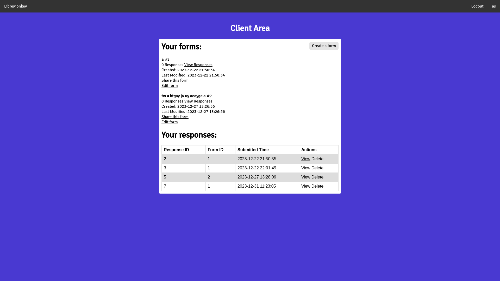
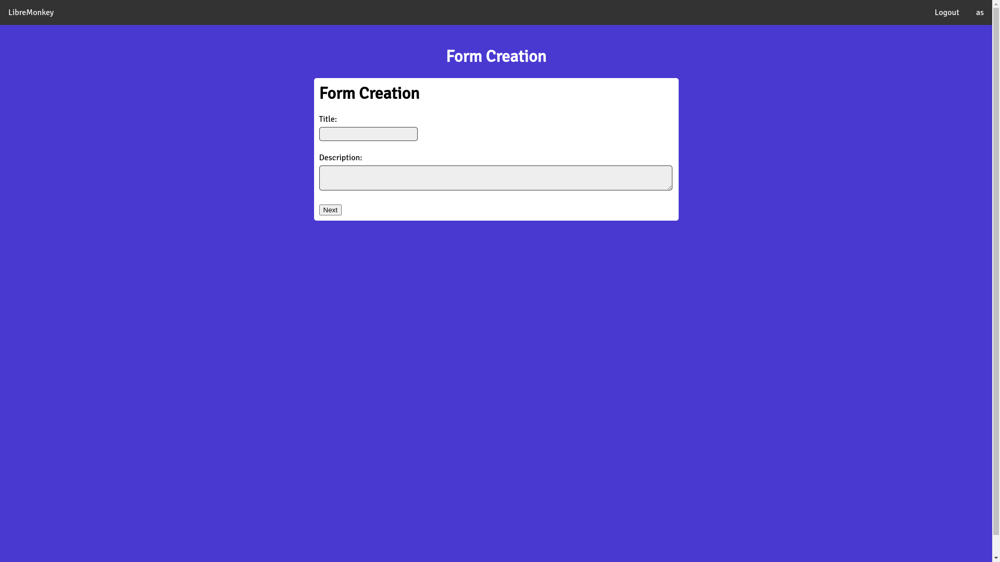
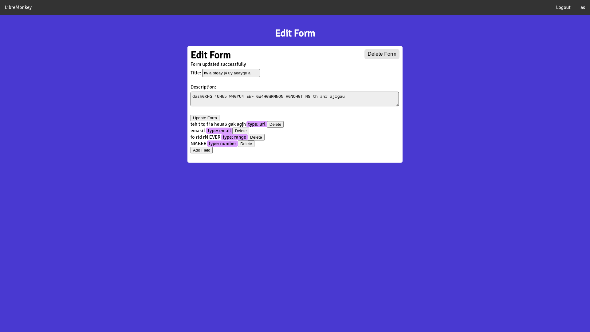
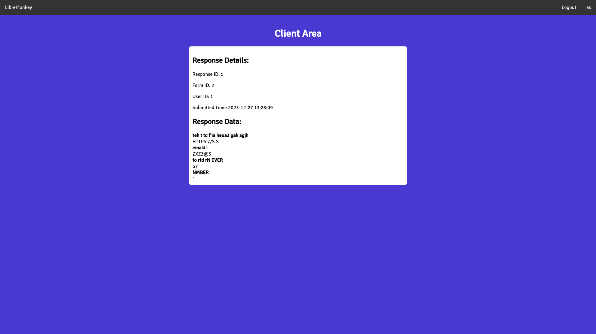
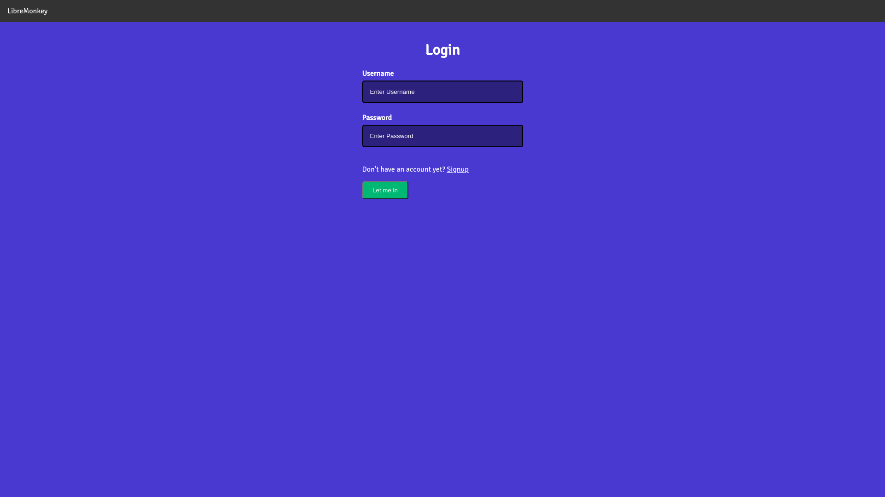

[](./LICENSE)
[](https://github.com/golddominik893/libremonkey/releases/latest)
[](https://github.com/golddominik893/libremonkey/commits)
[](https://github.com/golddominik893/libremonkey/issues)
[](https://github.com/golddominik893/libremonkey/pulls)

## LibreMonkey - create forms without spyware

> [!CAUTION]
> It is strongly not reccommended to deploy this software for production as there may be SQL injection vulnerabilities and there may also be a few other security vulnerabilities such as editing the fields in a form when you are not even logged in.

### Features

- Create Surveys
    - view responses
    - users can also view all their responses
    - **in a future update form owners can get averages for user responses or analytics.*
- No third party advertisements or data monetisation.
- It's Free Open Source Software, the free use is dependant on the instance operator.

### How it works

LibreMonkey uses the PHP backend alongside MySQL to store surveys and survey responses. LibreMonkey is the clear winner when in comparison to all the others because it is fast and does not sell your data.

### Screenshots (current stage)

| Home Page | Client Area |
|---|---|
|  |  |

| Form Creation | Form Editing |
|---|---|
|  |  |

| User Response | Login Page |
|---|---|
|  |  |

> [!NOTE]
> This software is still under development and may not work as intended.

### Prerequisites

- A web server like Apache or Nginx
- PHP interpreter
- SQL database like MySQL
- phpMyAdmin (OPTIONAL) 

### Installation

Clone the git repository

```bash
git clone https://github.com/GoldDominik893/libremonkey.git
cd libremonkey/
```

Move the contents of the libremonkey/ folder to the website root directory

```bash
mv * /var/www/html
```

Now Libremonkey will be accessible at `127.0.0.1:80`, but it requires an SQL database to operate.

The easiest way to import the database.sql file would be by using a WebGUI with phpMyAdmin, but you can do it by any other means.

Edit the `config.php` file to adjust the database credentials.

```bash
nano /var/www/html/config.php
```

### License

Libremonkey is licensed under the MIT License.

#### Liability

We take no responsibility for the use of our tool, or external instances
provided by third parties. We strongly recommend you abide by the valid
official regulations in your country. Furthermore, we refuse liability
for any inappropriate use of Libremonkey, such as illegal data collection.
This tool is provided to you in the spirit of free, open software.

You may view the LICENSE in which this software is provided to you [here](./LICENSE).

> THE SOFTWARE IS PROVIDED "AS IS", WITHOUT WARRANTY OF ANY KIND, EXPRESS OR
IMPLIED, INCLUDING BUT NOT LIMITED TO THE WARRANTIES OF MERCHANTABILITY,
FITNESS FOR A PARTICULAR PURPOSE AND NONINFRINGEMENT. IN NO EVENT SHALL THE
AUTHORS OR COPYRIGHT HOLDERS BE LIABLE FOR ANY CLAIM, DAMAGES OR OTHER
LIABILITY, WHETHER IN AN ACTION OF CONTRACT, TORT OR OTHERWISE, ARISING FROM,
OUT OF OR IN CONNECTION WITH THE SOFTWARE OR THE USE OR OTHER DEALINGS IN THE
SOFTWARE.
